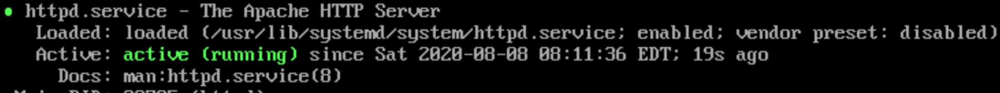

# Installation d'un serveur Aapche HTTPD

## Installation

* Mettre à jour les paquets
```
sudo yum update
```

* Installer la paquet httpd
```
sudo yum install httpd
```

* Lancer Apache
```
sudo systemctl start httpd
```

* Lancer apache au démarrage
```
sudo systemctl enable httpd
```

* Checker le status
```
sudo systemctl status httpd
```



* Ajouter les règles dans la parfeu

Par defaut CentOS empeche le traffic entrant vers 80 et 443

```
sudo firewall-cmd ––permanent ––add-port=80/tcp
```
```
sudo firewall-cmd ––permanent ––add-port=443/tcp
```


* Recharger le par feu pour appliquer les changements
```
sudo firewall-cmd ––reload
```

* Done ! 


## Configuration

* Les fichiers de configuration sont situé : __/etc/httpd__

* Le fichier de config principal est situé : __/etc/httpd/conf/httpd.conf__

* Les autres fichiers de configurations doivent : 
- se terminés par __.conf__
- s'inclure dans le fichier de conf principal
- se situer : __/etc/httpd/conf.d/__

* Il est possible d'ajouter des fonctionnalités à apache via des modules :
- Chemin : __/etc/httpd/conf.modules.d/__

* Logs
- chemin : __/var/log/httpd/__


## Commandes administration
* Stopper le service apache
```
sudo systemctl stop httpd
```

* Démarrer le service apache
```
sudo systemctl start httpd
```

* Redémarrer le service apache
```
sudo systemctl restart httpd
```

* Lancer apache au démarrage
```
sudo systemctl enable httpd
```

* Retirer apache au démarrage
```
sudo systemctl disable httpd
```