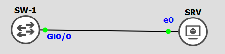
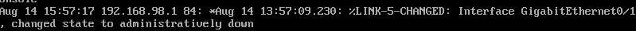

# Alerter - Pic d'activité :

Ressource :

*

## 0 Le laboratoire :


<div align="center">***Illustration 1 :*** *Le laboratoire.*</div>

Script de configuartion du laboratoire :
````text
Switch(config)# hostname SW-1
SW-1(config)# no ip domain-lookup

SW-1(config)# vlan 98
SW-1(config-vlan)# name MANAGEMENT
SW-1(config-vlan)# no shutdown
SW-1(config-vlan)# exit

SW-1(config)# interface vlan 98
SW-1(config-if)# no shutdown
SW-1(config-if)# ip address 192.168.98.1 255.255.255.0
SW-1(config-if)# exit

SW-1(config)#
````


## 1 SNMP :
Protocole qui utilise **UDP** sur les ports **161** et **162** :

* Le port 161 est utilisé par un serveur SNMP (debian) pour réaliser des reqêtes SNMP auprès d'un client (switch/routeur),
* Le port 162 est utilisé par le client SNMP (switch/routeur) pour envoyer des informations auprès du serveur SNMP (debian),

### 1.1 Debian installé un serveur SNMP :
````bash
apt-get install snmp snmpd
systemctl enable snmpd
nano /etc/snmp/snmpd.config

	# Replace this line :
		agentAddress  udp:127.0.0.1:161

	# By this line :
		agentAddress  udp:161

	# Save and exit
systemctl restart snmpd

# Check :
netstat -anu | grep 161
````


## 2 Syslog :
Protocole qui utilise **UDP** sur le port **514**.

### 2.1 Debian installer un serveur Syslog :
````bash
apt-get install rsyslog
systemctl enable rsyslog

# Check :
netstat -anu | grep 514
````

Configurer l'équipement Cisco :
````text
SW-1(config)# logging trap debugging
SW-1(config)# logging facility local4
SW-1(config)# logging 192.168.98.2
````

Explication des commandes :

* 1 Active le niveau maximal de verbosité des logs,
* 2 Définis le champs facility de syslog (quel est le type de message, voir RFC),
* 3 Spécifie l'adresse IP du serveur Syslog,

---

### 2.2 Vérifier :
Pour vérifier si la configuration fonctionne, je génère une ligne de log :
````text
SW-1(config)# interface GigabitEthernet 0/1
SW-1(config-if)# shutdown
````

En parrallèle sur le serveur syslog je lance cette commande :
````bash
tail -f /var/log/syslog
````

Retour du log  :

<div align="center">***Illustration 3 :*** *Syslog.*</div>

Nous pouvons constater que le client et le service Syslog sont fonctionnels.

