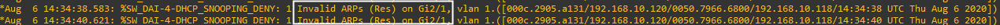

# Sécuriser - ARP et DHCP :

## 0 Le laboratoire :
Voici le laboratoire que j'utilise pour tester la sécurité des protocoles DHCP et ARP :


Adressage IP et MAC :
	* PC-1 ; DHCP ; 00:50:79:66:68:00 
	* PC-2 ; DHCP ; 00:50:79:66:68:01
	* DHCP ; 192.168.10.31/24 ; 00:0C:29:07:DB:B1
	* KALI ; DHCP ; 00:0C:29:05:A1:31
	* SW-1 ; 192.168.10.1/24 ; //

Tous les hôtes sont dans le vlan 1.

Configuration du serveur DHCP :
````text
option domain-name "example.org";
option domain-name-servers ns1.example.org, ns2.example.org;

defauylt-lease-time 600;
max-lease-time 7200;

subnet 192.168.10.0 netmask 255.255.255.0 {
	range 192.168.10.100 192.168.10.120;
	option subnet-mask 255.255.255.0;
	option broadcast-address 192.168.10.255;
}
````

---

## 1 Sécuriser le protocole DHCP :
Ressource :
 * https://formip.com/dhcp-snooping/
 * https://medium.com/@ayushir/dhcp-snooping-attack-ca728e4dd84

Attaque sur le protocole DHCP :
 * Une réservation totale des baux DHCP du vrai serveur DHCP, (DHCP Starvation)
 * Une distribution de DHCP Offer avec l'@IP de passerelle l'IP du rogue DHCP, (DHCP Spoofing)

Cisco à mis en place la fonction DHCP snooping, cette fonctionalité bloque toutes les trames DHCP Offer si elles ne proviennent pas d'un port trust sur le switch. 

---

### 1.1 Mise en place du DHCP snooping :
Mise en place du DHCP snooping :
````text
1. SW-1(config)# ip dhcp snooping
2. SW-1(config)# ip dhcp snooping vlan 1
3. SW-1(config)# no ip dhcp snooping information option
````

* Activation du DHCP snooping globalement.
* Activation du DHCP snooping sur le vlan 1, étape nécessaire sans celle-ci le DHCP snooping n'est pas fonctionnel.
* Commande optionnel, l'activation globale du DHCP snooping active l'option DHCP 82. 
	Cette option spécifie le réseau cible de demande (cela sert dans le DHCP relai pour que le serveur toruve le pool associé).
	Certain serveur DHCP n'apprécie pas cette option. C'est pourquoi il faut peut être la desactiver.

Trust du port Gi3/1 du switch car le serveur vrai serveur DHCP est connecté dessus :
````text
SW-1(config)# interface GigabitEthernet 3/1
SW-1(config-if)# ip dhcp snooping trust
SW-1(config-if)# ip dhcp snooping limit rate 80
````

* Sélection de l'interface,
* Trust de l'interface
* Mise en place d'un quota, dans l'exemple ce port est limité à 80 requêtes DHCP/secondes.

Mise en place du port security pour éviter que le serveur DHCP n'est plus de baux a proposer.

PC-1 :
````text
SW-1(config)# interface GigabitEthernet 1/1
SW-1(config-if)# switchport mode access
SW-1(config-if)# switchport port-security
SW-1(config-if)# switchport port-security max 3
SW-1(config-if)# switchport port-security violation shutdown
SW-1(config-if)# exit
````

PC-2 :
````text
SW-1(config)# interface GigabitEthernet 1/2
SW-1(config-if)# switchport mode access
SW-1(config-if)# switchport port-security max 3
SW-1(config-if)# switchport port-security violation shutdown
SW-1(config-if)# exit
````

KALI :
````text
SW-1(config)# interface GigabitEthernet 2/1
SW-1(config-if)# switchport mode access
SW-1(config-if)# switchport port-security max 3
SW-1(config-if)# switchport port-security violation shutdown
SW-1(config-if)# exit
````

Si il y a plus de trois adresse MAC associé à un port dans la table CAM du switch le port en question est éteint (shutdown).
Cette limitation permet de "voler" au maximum 3 baux par le pirate (DHCP Starvation) ce qui évite un DoS des configurations IP.

---

### 1.2 Vérification du DHCP snooping :
Commandes pour vérifier le DHCP snooping :
`````text
SW-1# show ip dhcp snooping
`````


Il est possible de noter que l'option 82 est désactivé et que l'interface Gi3/1 est une interface trust par le switch pour les trames DHCP Offer.

Commandes pour voir le cache des trames DHCP :
`````text
SW-1# show ip dhcp snooping binding
`````


Dans cette capture il est possible de voir que le DHCP à distribué trois baux DHCP, on y retrouve :
 * @MAC du client,
 * @IP distribué par le DHCP,
 * Lease time du bail DHCP,
 * Interface du client,

Il est possible de clear ce cache :
`````text
SW-1# clear ip dhcp snooping binding *
`````

Enfin pour le port-security :
````text
SW-1# show port-security
````


Nous pouvons remarquer que le port security permet à chaque port 3 adresse MAC différentes.
Une adresse MAC est déja utilisé sur chaque port il en reste donc deux de disponible.

---

### 1.3 Tentative d'attaque :
#### 1.3.1 DHCP Starvation :
Pour rappel le port security est actif est configurer pour autoriser 3 adresse MAC différentes sur chaque port du switch.
Utilisation de yersinia, depuis la VM KALI :
````bash
yersinia -G
````

Après un cours instant, la VM KALI réalise un nombre infinie de requête DHCP Discover dans l'objectif d'utiliser tous les baux DHCP du serveur DHCP.

Mais le port security limite à un maximum de 3 adresse MAC sur le port de la KALI (donc 3 demande DHCP Discover), ce qui à pour conséquence de placer le port en mode **err-disabled** et de le shutdown.

Aperçu :
````text
SW-1# show port-security
SW-1# show interface status
````


Afin de placer cette interface en status up :
````text
SW-1(config)# interface GigabitEthernet 2/1
SW-1(config-if)# shutdown
SW-1(config-if)# no shutdown
````

#### 1.3.2 DHCP Spoofing :
Pour rappel seul le port vers le serveur DHCP (GigabitEthernet 3/1) est trust pour les trames DHCP Offer.
Utilisation de ethercap, depuis la VM KALI :
````bash
ettercap -G
````

Afin de donner d'obtenir de meilleur résultat, je stop le service DHCP du serveur DHCP :
````bash
/etc/init.d/isc-dhcp-server stop
````

Les clients n'arrive pas à obtenir des requêtes DHCP car les trames de demande de bail DHCP sont uniquement envoyé sur les ports trusts.

Mais par exemple si je place l'interface de la VM KALI en mode trust :
````text
SW-1(config)# interface GigabitEthernet 2/1
SW-1(config-if)# ip dhcp snooping trust
````

Et que depuis PC-1 et PC-2 je renouvelle ma demande de bail DHCP alors j'obtiens une configuration IP :
````text
PC-1> ip dhcp
PC-2> ip dhcp
````

Depuis Ethercap :


Configuration IP des postes :
````text
PC-1> show ip
````


La VM Kali est devenus la Gateway sur les postes.

Mais sans la modification du switch pour trust le port de la KALI, les clients n'aurai jamais obtenu cette configuration IP.

---

## 2 Sécuriser le protocole ARP :  
Ressource :
 * https://formip.com/dai/

Pour sécuriser le protocole ARP, il est possible de s'appuyer sur la fonctionalité DHCP snooping. En effet cette fonctionalité construit une table (que l'on peux consulter avec la commande : 
````text
show ip dhcp snooping binding
````

Au sein des switchs Cisco il existe la fonctionalité Dynamic ARP Inspection (DAI). Pour valider qu'un hôte à l'IP qu'il prétend avoir, le switch vérifie son association @MAC et @IP dans la table du DHCP snooping.

### 2.1 Mise en place du DAI :
Pour mettre en place DAI :
````text
Switch(config)# ip arp inspection vlan 1
````

Toutes les trames qui circulent sont analysés sur l'adresse MAC et l'adresse IP. 
Si l'association MAC <-> IP n'est pas référencé dans la table snooping binding, le switch drop la trame.
Cal fonctionne pour les postes qui utilise le DHCP et qui sont rérencé dans cette table, mais pour les postes qui utilisent des configurtaion IP statique, le switch va dropper les trames car l'association MAC <-> IP n'est pas référencé.

Pour cela il est possible de trust un port ou un poste est configuré avec une IP fixe, ce qui est le cas du port GigabitEthernet3/1 ou le serveur DHCP est connecté :
````text
Switch(config)# interface GigabitEthernet 3/1
Switch(config-if)# ip arp inspection trust
````

### 2.2 Tentative d'attaque :
Depuis KALI je vais tenter d'empoisoner la table ARP de PC-1 pour me faire passer pour PC-2, la table ARP de PC-1 est actuellement vide.

Pour rappel :
 * PC-1 : 00:50:79:66:68:00, 192.168.10.118
 * PC-2 : 00:50:79:66:68:01, 192.168.10.120
 * KALI : 00:0C:29:05:A1:31, 192.168.10.104

Depuis KALI :
````bash
arpspoof -t 192.168.10.118 192.168.10.120
````
Traduction littérale :
Auprès de PC-1 (192.168.10.118) fait moi passer pour PC-2 (192.168.10.120).

Sur le poste le cache ARP est vide :
````text
PC-1> show arp
````


Mais depuis le switch (SW-1), il est possible d'observer ces lignes de logs :


Le switch a détecter que KALI envoie des réponses ARP falsifiés car cette association (MAC <-> IP ) n'est pas présente :
 * Dans le cache DHCP snooping,
 * Le port n'a pas été définis en trust donc cette association n'est pas pris en compte par le switch,


## 3 Conclusion :
Pour conclure sur la sécurité des protocoles :
 * Attaque DHCP Starvation -> Port Security,
 * Attaque DHCP Spoofing -> DHCP Snooping,
 * Attaque ARP Spoofing -> DAI avec DHCP Snooping,