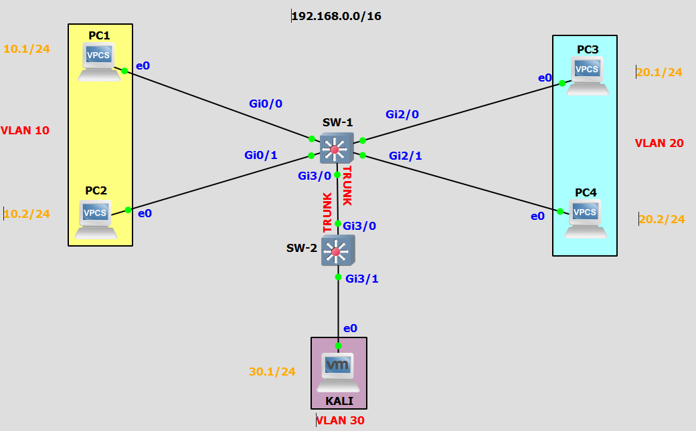

# Sécuriser - Les VLAN :

Ressource :
 * https://www.orange-business.com/fr/blogs/securite/bonnes-pratiques/la-verite-sur-lattaque-vlan-hopping#:~:text=DTP%20%3A%20pour%20certains%20auteurs%2C%20il,VLAN%20connus%20du%20switch%20attaqué.

Cette documentation illustre les méthodes pour mitiguer les attaques âr rebonds de VLAN.

Il existe deux méthodes pour réaliser cette attaque :
 * Double tag,
 * Protocole DTP,

## 0 Le laboratoire :
Voici le laboratoire que j'utilise pour ce lab :


Ce lab est composer de trois VLAN :
 - VLAN 10 ; 192.168.10.0/24
 - VLAN 20 ; 192.168.20.0/24
 - VLAN 30 ; 192.168.30.0/24

Une liason **trunk** est entre le SW-1 et le SW-2.

Script de configuration de SW-1 :
````text
####### VLAN
	vlan 10
		name vlan_1
		no shutdown
	exit
	vlan 20
		name vlan_2
		no shutdown
	exit
	vlan 30
		name vlan_3
		no shutdown
	exit

####### INTERFACE VLAN
	interface vlan 10
		ip address 192.168.10.10/24 255.255.255.0
		no shutdown
	exit
	interface vlan 20
		ip address 192.168.20.10/24 255.255.255.0
		no shutdown
	exit
	interface vlan 30
		ip address 192.168.30.10/24 255.255.255.0
		no shutdown
	exit

####### INTERFACE
	interface GigabitEthernet0/0
		switchport mode access
		switchport access vlan 10
		no shutdown
	exit
	interface GigabitEthernet0/1
		switchport mode access
		switchport access vlan 10
		no shutdown
	exit
	interface GigabitEthernet2/0
		switchport mode access
		switchport access vlan 20
		no shutdown
	exit
	interface GigabitEthernet2/1
		switchport mode access
		switchport access vlan 20
		no shutdown
	exit
	interface GigabitEthernet3/0
		switchport trunk encapsulation dot1q
		switchport mode trunk
		switchport trunk allowed vlan all
		no shutdown
	exit

hostname SW-1
do wr
````

Script de configuration de SW-2 :
````text

####### VLAN
	vlan 10
		name vlan_1
		no shutdown
	exit
	vlan 20
		name vlan_2
		no shutdown
	exit
	vlan 30
		name vlan_3
		no shutdown
	exit

####### INTERFACE VLAN
	interface vlan 10
		ip address 192.168.10.20/24 255.255.255.0
		no shutdown
	exit
	interface vlan 20
		ip address 192.168.20.20/24 255.255.255.0
		no shutdown
	exit
	interface vlan 30
		ip address 192.168.30.20/24 255.255.255.0
		no shutdown
	exit

####### INTERFACE
	interface GigabitEthernet3/0
		switchport trunk encapsulation dot1q
		switchport mode trunk
		switchport trunk allowed vlan all
		no shutdown
	exit
	interface GigabitEthernet3/1
		switchport mode access
		switchport access vlan 30
		no shutdown
	exit

hostname SW-2
do wr
````

---

## 1 Le double tag :
### 1.1 Explications :
Cette attaque est possible uniquement quand une liason trunk est configuré entre deux switch.
Pour rappel la norme dot1q ajoute un champ dans les trames ethernet, ce champ specifie le numéros du vlan qui est associé à la trame.
L'objectif de cette action est de diffusé uniquement la trame au vlan associé.

Par exemple une trame de demande ARP est émise par un poste elle est diffusé dans le VLAN 10.
1. Le switch regarde les ports qui sont positionné dans le VLAN 10 et transmet la trame,
2. Ensuite le switch ajoute un champ **VLAN_ID** dans la trame ethernet qui correspond au numéros de VLAN (VLAN 10),
3. Le switch transmet cette trame au second switch,
4. Le second switch ouvre la trame récupère la valeur de VLAN_ID,
5. Et il transmet la trame aux ports configurés dans le VLAN 10,

Dans ce contexte, le poste envoie au switch (avant l'étape 1) une trame doublement entaguée :


L'attaquant envoie une trame avec deux balise 802.1Q :
 - la balise interne correspond au vlan natif,
 - la balise externe correspond au vlan que l'attaquant souhaite contacter,

Le switch reçoit cette trame et il :
1. Supprime la première entête 802.1Q (vlan natif),
2. Il relais la trame à l'ID de vlan de la seconde entête,

Le vlan natif, il est utilisé lorsqu'un port configuré en trunk reçoit une trame non taguée.
Lorsqu'un port trunk reçoit une trame non taguée il l'envoie dans le vlan natif.

---

### 1.2 Attaque :

---

### 1.3 Mitigation :

---

## 2 Le protocole DTP :

---

### 2.1 Explications :

---

### 2.2 Attaque :

---

### 2.3 Mitigation :

---