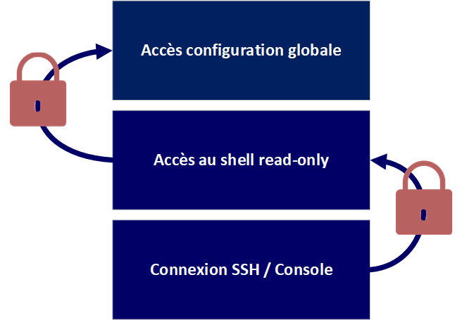

# Sécuriser - Les mots de passe sur Cisco :

Ressource :

* [https://cisco.goffinet.org/ccna/gestion-securisee-peripheriques/chiffrement-des-mots-de-passes-locaux-cisco-ios/](https://cisco.goffinet.org/ccna/gestion-securisee-peripheriques/chiffrement-des-mots-de-passes-locaux-cisco-ios/)
* [https://fr.wikipedia.org/wiki/Scrypt](https://fr.wikipedia.org/wiki/Scrypt)

---

## 0 Le laboratoire :
Voici le laboratoire que j'utilise pour ce sujet :


<div align="center">***Illustration 1 :*** *Plan réseau du laboratoire.*</div>

Il est possible de distinguer deux types d'accès aux équipements Cisco :

* out-band ; accès par la console (ne nécessite pas de configuration réseau ; ex câble console, etc.),
* in-band ; accès par un service réseau (nécessite une configuration IP ; ex SSH, etc.),

---

## 1 Accès out-band :
Pour définir un mot de passe pour l'accès à la console de manière sécurisé, j'utilise force une authentification locale.
````text
SW-1(config)# line console 0
SW-1(config-line)# login local
SW-1(config-line)# exit
````

Création de l'utilisateur associé :
````text
SW-1(config)# username worldskills privilege 1 algorithm-type scrypt secret worldskills
````

Le mot de passe est défini en type 9 tandis que le sha-256 est définis en type 8. Donc le scrypt apporte un gain de sécurité.

Lorsque l'on regarde la configuration :
````text
SW-1# sh run
````


<div align="center">***Illustration 2 :*** *Mot de passe enable chiffré.*</div>

Nous pouvons constater que le mot de passe **worldskills** est chiffré et de type 9.

---

## 2 Accès in-band :
Pour avoir un accès in-band, il est nécessaire de définir une  une configuration IP sur le switch.

---

### 2.1 Activer SSH :

Prérequis :
````text
SW-1(config)# ip domain-name test.com
SW-1(config)# crypto key generate rsa modulus 4096
````

* 1 Définir un nom de domaine pour la paire de clé,
* 2 Générer la paire de clé,

Activer SSH :
````text
SW-1(config)# ip ssh version 2
SW-1(config)# line vty 0 15
SW-1(config-line)# login local
SW-1(config-line)# transport input ssh
SW-1(config-line)# exit
````

* 1 Activer le protocole SSH,
* 2 Sélectionner les terminaux virtuels 0 à 15,
* 3 Spécifier une authentification locale,
* 4 Spécifier que l'on utilise SSH sur ces terminaux,

---

### 2.2 Créer un administrateur :
Création d'un administrateur **worldskills** avec le mot de passe **worldskills** :
````text
SW-1(config)# username worldskills privilege 1 algorithm-type scrypt secret worldskills
````

Détail des options :

* privilege 1, spécifie que cet utilisateur possède des droits utilisateurs
* algorithme-type, permet de spécifier quel sea l'algorithme de chiffrement utilisé pour chiffrer le mot de passe dans la configuration,

Lorsque l'on regarde la configuration, on peut voir les deux mots de passe chiffrés :

<div align="center">***Illustration 3 :*** *Mots de passe chiffrés.*</div>

Les deux mots de passe sont de type 9 en scrypt.

---

## 3 Accès en mode priviliégé :
Il est possible de rajouter une dernière sécurité, le passage en mode priviliégé.
Quand l'utilisateur worldskills se connecte en SSH ou en Console il n'est pas dans le mode configuration global.
Il ne peut pas modifier les paramètres (privilege 1).
Pour rajouter une couche supplémentaire de sécurité il est possible de définir un mot de passe sur le passe en mode configuration globale :
````text
SW-1(config)# enable secret algorithm-type scrypt secret superPassword
````


<div align="center">***Illustration 4 :*** *Schéma des authentifications locales.*</div>

## 4 Service de chiffrement des mots de passe :
Au sein d'IOS, il existe une fonction qui chiffre les mots de passe qui sont déjà spécifié dans la configuration et les mots de passe qui seront spécifiés dans le futur. Cette fonction s'appele **password-encryption**.

Pour activer cette fonction :
````text
SW-1(config)# service password-encryption
````

---

## 5 Conclusion :
Pour sécuriser l'accès à un équipement Cisco, il faut définir des mots de passe sur :

* L'accès à la console,
* L'accès depuis un protocole distant,

Ces mots de passe doivent être chiffrés dans la configuration à l'aide de l'algorithme **scrypt**.