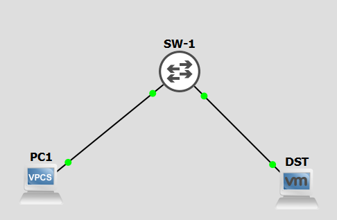

# Port mirroring :

L'objectif du port mirroring est de rediriger toutes les trames sur un port spécifique.
On distingue deux type de port mirroring :

* SPAN (le port mirroir ce toruve sur le même switch),
* RSPAN (le port de mirroir ce trouve sur un switch distant),

Lors de l'utilisation d'un NSM obtenir tous les échanges réseaux d'un SI est gain considérable d'information pour la détection d'intrusion.

Ressource :

* [https://cisco.goffinet.org/ccna/filtrage/csco-switchport-analyzer-span/](https://cisco.goffinet.org/ccna/filtrage/csco-switchport-analyzer-span/)

---

## 1 SPAN :
Le trafic d'un ou des ports est redirigé sur un port du switch.

---

### 1.1 Le laboratoire :

<div align="center">
	<i><b>Illustration 1 :</b> Laboratoire 1.</i>
</div>

Script de configuration initial de SW-1 :
````text
Switch# configuration terminal
Switch(config)# hostname SW-1
SW-1(config)# do wr mem
````

---

### 1.2 Mise en oeuvre :
Malheuresement le SPAN et le RSPAN n'est pas implémenté dans mes images IOS dans GNS : [https://learningnetwork.cisco.com/s/article/iosvl2-more-info-updated-10-2-15-x](https://learningnetwork.cisco.com/s/article/iosvl2-more-info-updated-10-2-15-x).

Mais pour réaliser du SPAN c'est très simple :

* Interface GigabitEthernet 0/0 = interface source,
* Interface GigabitEthernet 0/1 = interface destination,

Sur le switch :
````text
SW-1(config)# monitor session 1source interface GigabitEthernet 0/0 
SW-1(config)# monitor session 1source destination GigabitEthernet 0/1 encapsulation replicate
```` 

Note, l'option **encapsulation replicate** dans la seconde commande permet d'inclure les protocoles CDP, DTP, STP, VTP...


---

## 2 RSPAN :
Le trafic d'un ou des ports est redirigé sur une lisason trun d'un autre switch. Le port de l'autre switch récupère tous le traffic pour le redirigé vers le port de mirroring.

Script de configuration initial de SW-1 :
````text
Switch# configuration terminal
Switch(config)# hostname SW-1
SW-1(config)# do wr mem
````

Script de configuration initial de SW-2 :
````text
Switch# configuration terminal
Switch(config)# hostname SW-2
SW-2(config)# do wr mem
````

---

### 2.1 Le laboratoire :

<div align="center">
	<i><b>Illustration 2 :</b> Laboratoire 2.</i>
</div>

---

### 2.2 Mise en oeuvre :
Malheuresement le SPAN et le RSPAN n'est pas implémenté dans mes images IOS dans GNS : [https://learningnetwork.cisco.com/s/article/iosvl2-more-info-updated-10-2-15-x](https://learningnetwork.cisco.com/s/article/iosvl2-more-info-updated-10-2-15-x).

Mais pour réaliser du SPAN :
Sur SW-1 :

* Interface GigabitEthernet 0/0 = interface source,
* VLAN 199 = interface destination,

Sur SW-2 :
* VLAN 199 = interface source,
* Interface GigabitEthernet 0/0 = interface destination,

Le VLAN 199 transite via le le trunk entre SW-1 et SW-2 sur GigabitEthernet0/0.

Sur le switch SW-1 :
````text
SW-1(config)# vlan 199
SW-1(config-vlan)# name SPAN
SW-1(config-vlan)# remote span
SW-1(config-vlan)# exit
SW-1(config)# monitor session 1 source interface GigabitEthernet0/0 
SW-1(config)# monitor session 1 destination remote vlan 199 encapsulation replicate
SW-1(config)# interface GigabitEthernet3/3
SW-1(config-if)# switchport trunk encapsulation dot1q
SW-1(config-if)# switchport mode trunk
SW-1(config-if)# switchport trunk allowed vlan 199
```` 

Sur le switch SW-2 :
````text
SW-2(config)# vlan 199
SW-2(config-vlan)# name SPAN
SW-2(config-vlan)# remote span
SW-2(config-vlan)# exit
SW-2(config)# monitor session 2 source remote vlan 199
SW-2(config)# monitor session 2 destination interface GigabitEthernet 0/0 encapsulation replicate
SW-2(config)# interface GigabitEthernet3/3
SW-2(config-if)# switchport trunk encapsulation dot1q
SW-2(config-if)# switchport mode trunk
SW-2(config-if)# switchport trunk allowed vlan 199
```` 

Note, l'option **encapsulation replicate** dans la seconde commande permet d'inclure les protocoles CDP, DTP, STP, VTP...


---

