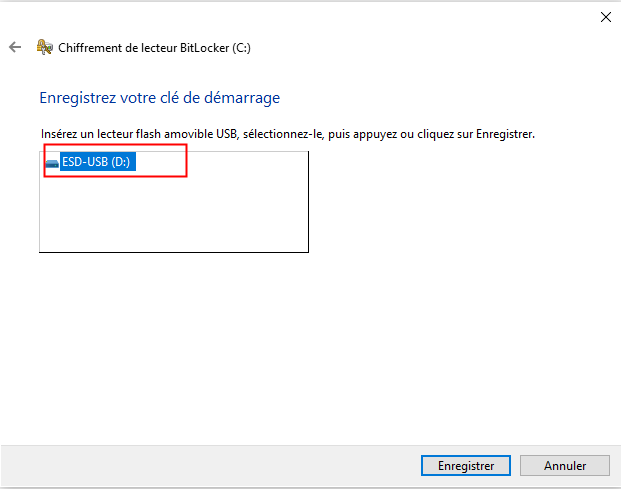
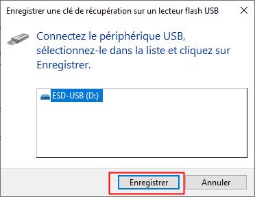

# Activer le chiffrement des données :

Ressource :
 
* [https://theitbros.com/config-active-directory-store-bitlocker-recovery-keys/](https://theitbros.com/config-active-directory-store-bitlocker-recovery-keys/)

Création de la GPO **SECURE-DISK** par défaut à la racine du domaine.
L'objectif est de sauvegarder les clés de récupérations des lecteurs des postes du SI sur Active Directory.

## 1 Active Directory :
### 1.1 Console :
Installation de la console pour visualier les clés de chiffrements bitlocker depuis Active Directory :
````powershell
Install-WindowsFeature RSAT-Feature-Tools-BitLocker-BdeAducExt
````

---

### 1.2 GPO :
#### 1.2.1 Définir l'algorithme de chiffrement :
Voici le chemin du paramètre de sécurité :
**Configuration Ordinateur** -> **Stratégies** -> **Modèles d’administration** -> **Composants Windows** -> **Chiffrement de lecteur BitLocker** 

Modifier le paramètre :
**Choisir la méthode et la puissance de chiffrement des lecteurs (Windows 10 [Version 1511] et ultérieur)**.

Pour le définir comme ceci :


---

#### 1.2.2 Définir les lecteurs chiffrés :
Voici le chemin du paramètre de sécurité :
**Configuration Ordinateur** -> **Stratégies** -> **Modèles d’administration** -> **Composants Windows** -> **Chiffrement de lecteur BitLocker** -> **Lecteurs du système d'exploitation**.

Modifier le paramètre :
**Sélectionner la méthode de récupération des lecteurs amovibles protégés par BitLocker**.

Pour le définir comme ceci :


Ce paramètre permet de sauvegarder dans Active Directory uniquement pour le lecteur ou l'OS est installé (par défaut C:) :

* Les mots de passe de récupération,
* Les packages de clés,

Mais il est possible de sauvegarder **Les mots de passe de récupération** et **Les packages de clés** des lecteurs amovibles et fixes via le chemins :

* **Configuration Ordinateur** -> **Stratégies** -> **Modèles d’administration** -> **Composants Windows** -> **Chiffrement de lecteur BitLocker** -> **Lecteurs de données fixes**,

* **Configuration Ordinateur** -> **Stratégies** -> **Modèles d’administration** -> **Composants Windows** -> **Chiffrement de lecteur BitLocker** -> **Lecteurs de données amovibles**,

---

#### 1.2.3 Restreindre le dévérouillage par clé USB au démarrage :
Voici le chemin du paramètre de sécurité :
**Configuration Ordinateur** -> **Stratégies** -> **Modèles d’administration** -> **Composants Windows** -> **Chiffrement de lecteur BitLocker** -> **Lecteurs du système d'exploitation**

Modifier le paramètre :
**Exiger une authentification supplémentaire au démarrage**.

Pour le définir comme ceci :


---

## 2 Configuration sur les postes :
Sur les postes forcer la mise à jour des startégies de groupes :
````batch
gpupdate /force
````

Insérer une clé USB dans le client.


Puis suivre cette procédure :








Dans la console de l'Active Directory **Utilisateur et Ordinateur**, il est possible de voir dans l'onglet **Récupération Bitlocker** la clé de récupération remontée par l'agent :


---

